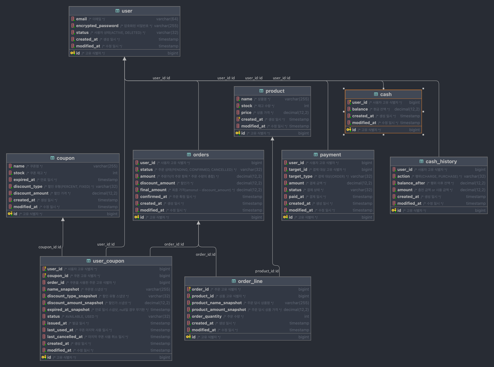

# Entity Relational Diagram (ERD)

updatedAt: 2025.09.19



## Script

```sql
create table hhplus.cash
(
    id          bigint auto_increment comment '고유 식별자' primary key,
    user_id     bigint                                   not null comment '사용자 고유 식별자',
    balance     decimal(12, 2) default 0.00              not null comment '현금 잔액',
    created_at  timestamp      default CURRENT_TIMESTAMP not null comment '생성 일시',
    modified_at timestamp      default CURRENT_TIMESTAMP not null comment '수정 일시',
    constraint uidx_cash_user_id unique (user_id)
);

create table hhplus.cash_history
(
    id            bigint auto_increment comment '고유 식별자' primary key,
    user_id       bigint                                   not null comment '사용자 고유 식별자',
    action        varchar(32)                              not null comment '행위(CHARGE, PURCHASE)',
    balance_after decimal(12, 2) default 0.00              not null comment '행위 이후 잔액',
    amount        decimal(12, 2) default 0.00              not null comment '충전 금액 or 사용 금액',
    created_at    timestamp      default CURRENT_TIMESTAMP not null comment '생성 일시',
    modified_at   timestamp      default CURRENT_TIMESTAMP not null comment '수정 일시'
);

create table hhplus.coupon
(
    id              bigint auto_increment comment '고유 식별자' primary key,
    name            varchar(255)                             not null comment '쿠폰명',
    stock           int            default 0                 not null comment '쿠폰 재고',
    expired_at      timestamp                                null comment '만료 일시',
    discount_type   varchar(32)                              not null comment '할인 유형(PERCENT, FIXED)',
    discount_amount decimal(12, 2) default 0.00              not null comment '할인 가격',
    created_at      timestamp      default CURRENT_TIMESTAMP not null comment '생성 일시',
    modified_at     timestamp      default CURRENT_TIMESTAMP not null comment '수정 일시'
);

create table hhplus.order_line
(
    id                      bigint auto_increment comment '고유 식별자' primary key,
    order_id                bigint                                   not null comment '주문 고유 식별자',
    product_id              bigint                                   not null comment '상품 고유 식별자',
    product_name_snapshot   varchar(255)                             not null comment '주문 당시 상품명',
    product_amount_snapshot decimal(12, 2) default 0.00              not null comment '주문 당시 상품 가격',
    order_quantity          int            default 0                 not null comment '주문 수량',
    created_at              timestamp      default CURRENT_TIMESTAMP not null comment '생성 일시',
    modified_at             timestamp      default CURRENT_TIMESTAMP not null comment '수정 일시'
);

create index idx_order_line_order_id
    on hhplus.order_line (order_id);


create table hhplus.orders
(
    id              bigint auto_increment comment '고유 식별자' primary key,
    user_id         bigint                                   not null comment '사용자 고유 식별자',
    status          varchar(32)    default 'PENDING'         not null comment '주문 상태(PENDING, CONFIRMED, CANCELLED)',
    amount          decimal(12, 2) default 0.00              not null comment '주문가(각 주문 항목 * 주문 수량의 총합)',
    discount_amount decimal(12, 2) default 0.00              not null comment '할인가',
    final_amount    decimal(12, 2) default 0.00              not null comment '최종 가격(amonut - discount_amount)',
    confirmed_at    timestamp                                null comment '주문 확정 일시',
    created_at      timestamp      default CURRENT_TIMESTAMP not null comment '생성 일시',
    modified_at     timestamp      default CURRENT_TIMESTAMP not null comment '수정 일시'
);

create table hhplus.payment
(
    id          bigint auto_increment comment '고유 식별자' primary key,
    user_id     bigint                                   not null comment '사용자 고유 식별자',
    target_id   bigint                                   not null comment '결제 대상 고유 식별자',
    target_type varchar(32)                              null comment '결제 대상(ORDER)',
    amount      decimal(12, 2) default 0.00              not null comment '결제 금액',
    status      varchar(32)    default 'PENDING'         not null comment '결제 상태',
    paid_at     timestamp                                null comment '결제 일시',
    created_at  timestamp      default CURRENT_TIMESTAMP not null comment '생성 일시',
    modified_at timestamp      default CURRENT_TIMESTAMP not null comment '수정 일시'
);

-- 최신순 상품 목록 조회를 가장 많이 할 것으로 판단하여, created_at 컬럼의 인덱스를 내림차순으로 생성했습니다.
create table hhplus.product
(
    id          bigint auto_increment comment '고유 식별자' primary key,
    name        varchar(255) default ''                not null comment '상품명',
    stock       int          default 0                 not null comment '재고 수량',
    price       decimal(12, 2)                         null comment '상품 가격',
    created_at  timestamp    default CURRENT_TIMESTAMP null comment '생성 일시',
    modified_at timestamp    default CURRENT_TIMESTAMP null comment '수정 일시'
);

create index idx_product_created_at
    on hhplus.product (created_at desc);

create table hhplus.user
(
    id                 bigint auto_increment comment '고유 식별자' primary key,
    email              varchar(64)                           not null comment '이메일',
    status             varchar(32) default 'ACTIVE'          not null comment '사용자 상태(ACTIVE, DELETED)',
    encrypted_password varchar(255)                          not null comment '암호화된 비밀번호',
    created_at         timestamp   default CURRENT_TIMESTAMP not null comment '생성 일시',
    modified_at        timestamp   default CURRENT_TIMESTAMP not null comment '수정 일시'
);

create table hhplus.user_coupon
(
    id                       bigint auto_increment comment '고유 식별자' primary key,
    user_id                  bigint                                   not null comment '사용자 고유 식별자',
    coupon_id                bigint                                   not null comment '쿠폰 고유 식별자',
    order_id                 bigint                                   null comment '쿠폰을 사용한 주문 고유 식별자',
    name_snapshot            varchar(255)   default ''                not null comment '쿠폰명 스냅샷',
    discount_type_snapshot   varchar(32)    default 'FIXED'           not null comment '할인 유형 스냅샷',
    discount_amount_snapshot decimal(12, 2) default 0.00              not null comment '할인가 스냅샷',
    expired_at_snapshot      timestamp      default CURRENT_TIMESTAMP not null comment '만료 일시 스냅샷, null일 경우 무기한',
    status                   varchar(32)                              null comment 'AVAILABLE, USED',
    issued_at                timestamp      default CURRENT_TIMESTAMP not null comment '발급 일시',
    last_used_at             timestamp                                null comment '쿠폰 마지막 사용 일시',
    last_cancelled_at        timestamp                                null comment '마지막 쿠폰 사용 취소 일시',
    created_at               timestamp      default CURRENT_TIMESTAMP not null comment '생성 일시',
    modified_at              timestamp      default CURRENT_TIMESTAMP not null comment '수정 일시',
    constraint uidx_user_coupon_user_id_coupon_id
        unique (user_id, coupon_id)
);


```

