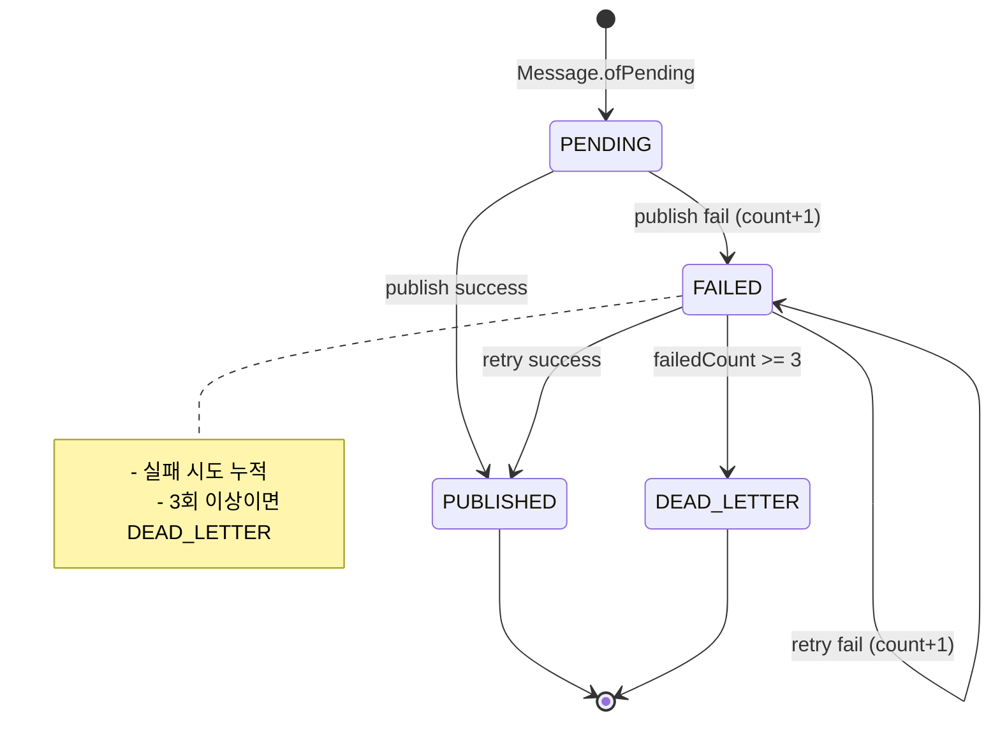
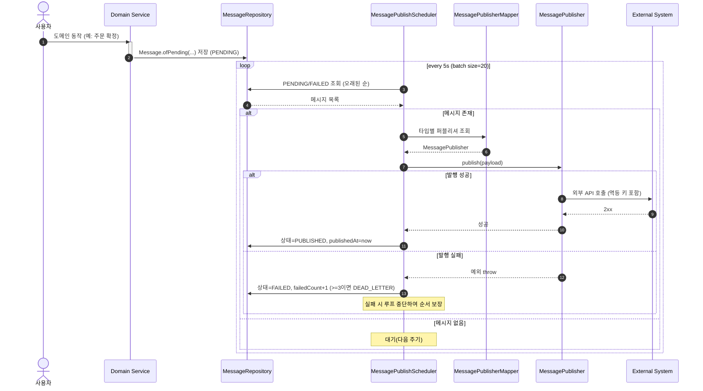

# 외부 시스템 연동 가이드

## 1. 개요

외부 시스템과 연동할 때, 데이터 정합성을 지키는 것은 굉장히 중요합니다.
내부 시스템과 외부 시스템과의 데이터가 일치하지 않을 경우, 데이터에 대한 신뢰도는 당연하게 떨어지게 됩니다.

데이터 정합성을 지키기 위해서, Transactional Outbox Pattern을 기반으로 message 테이블을 구현했습니다.

## 2. Transactional Outbox Pattern 이란?

Transactional Outbox Pattern은 Database 저장과 외부 시스템 연동을 원자적으로 처리하는 패턴입니다.

### 해결하려는 문제

외부 시스템을 연동 시 다음과 같은 이슈가 발생할 수 있습니다.

- DB는 커밋됐는데 외부 API 호출이 실패하는 경우
- 외부 API는 성공했는데 DB 트랜잭션이 롤백되는 경우
- 네트워크 지연이나 타임아웃으로 인한 불확실성

### 적용 대상

동기적인 처리가 필수가 아닌 경우에 적합합니다.

- 알림 발송 (Slack, Email, SMS)
- 결제 환불 처리
- 데이터 동기화
- 이벤트 로깅

## 3. 아키텍처

### 3-1. 컴포넌트 구조

본 가이드는 아래 컴포넌트를 활용합니다.

- Message 도메인: `kr.hhplus.be.commerce.domain.message.model.Message`
- 상태: `kr.hhplus.be.commerce.domain.message.enums.MessageStatus`
- 저장소 포트: `kr.hhplus.be.commerce.domain.message.repository.MessageRepository`
- 퍼블리셔 매퍼: `kr.hhplus.be.commerce.domain.message.mapper.MessagePublisherMapper`
- 퍼블리셔 SPI: `kr.hhplus.be.commerce.domain.message.publisher.MessagePublisher`
- 발행 스케줄러: `kr.hhplus.be.commerce.application.message.scheduler.MessagePublishScheduler`

### 3-2. 상태 다이어그램

- message 테이블에 외부 발행해야 할 이벤트를 트랜잭션 내에서 영속화합니다.
- 스케줄러가 message 테이블을 주기적으로 폴링하며 외부 발행을 시도합니다.
- 실패 시 상태/횟수를 누적하여 재시도, 임계치 초과 시 DEAD_LETTER 상태로 전이되며 이후에 정책에 맞춰 수동 처리가 필요합니다.

상태 수명주기

- PENDING → (발행 성공) → PUBLISHED
- PENDING/FAILED → (발행 실패 누적) → FAILED → DEAD_LETTER(임계치 3회)



### 3-3. 시퀀스 다이어그램

- 스케줄러가 5초마다 PENDING/FAILED 상태를 오래된 순서로 최대 20건 가져옵니다.
- `MessagePublisherMapper`가 타입별 퍼블리셔를 선택하여 외부 API 호출을 수행합니다.
- 성공 시: `PUBLISHED`로 갱신
- 실패 시: `FAILED`로 갱신하고 실패 횟수+1, 임계치(3) 이상이면 `DEAD_LETTER`
- 순서 보장: 배치 처리 중 실패가 발생하면 해당 루프를 중단하여 앞선 실패를 먼저 해결하도록 설계되어 있습니다.



## 4. 구현 가이드

### 4-1. Message 저장

- 도메인 트랜잭션에서 외부 호출 대신 메시지를 저장합니다.

```java
class OrderPlaceProcessor {
	Output execute(Command command) {
		private final MessageRepository messageRepository;
		// ...
		messageRepository.save(Message.ofPending(
			order.id(),
			MessageTargetType.ORDER,
			OrderConfirmedMessagePayload.from(order.id())
		));
		// ...
	}
}
```

### 4-2. MessageType 추가

```java

@Getter
@RequiredArgsConstructor
public enum MessageType {
	ORDER_CONFIRMED("결제가 완료된 주문건", OrderConfirmedMessagePayload.class);

	private final String description;
	private final Class<? extends MessagePayload> payloadClass;
}
```

### 4-3. MessagePayload 구현

```java

@Builder(access = AccessLevel.PRIVATE)
public record OrderConfirmedMessagePayload(
	MessageType type,
	Long orderId
) implements MessagePayload {
	public static OrderConfirmedMessagePayload from(Long orderId) {
		return OrderConfirmedMessagePayload.builder()
			.type(MessageType.ORDER_CONFIRMED)
			.orderId(orderId)
			.build();
	}

}
```

### 4-4. MessagePublisher 구현

```java

@Component
public class OrderConfirmedMessagePublisher implements MessagePublisher<OrderConfirmedMessagePayload> {
	private final SlackSendMessageClient slackSendMessageClient;

	public OrderConfirmedMessagePublisher(SlackSendMessageClient slackSendMessageClient) {
		this.slackSendMessageClient = slackSendMessageClient;
	}

	@Override
	public MessageType getSupportingMessageType() {
		return MessageType.ORDER_CONFIRMED;
	}

	@Override
	public void publish(OrderConfirmedMessagePayload messagePayload) {
		slackSendMessageClient.send(messagePayload.toString());
	}

}
```

## 6. 성능 최적화

- 배치 크기 조정: 처리량에 따라 20건 -> 50건으로 증가 가능합니다.
- (TODO) 오래된 발행된(PUBLISHED) 메세지는 정책에 맞춰 주기적인 삭제가 필요합니다.
- 인덱스: `(status, created_at)` 폴링하는 쿼리에 맞춰 복합 인덱스를 추가했습니다.


