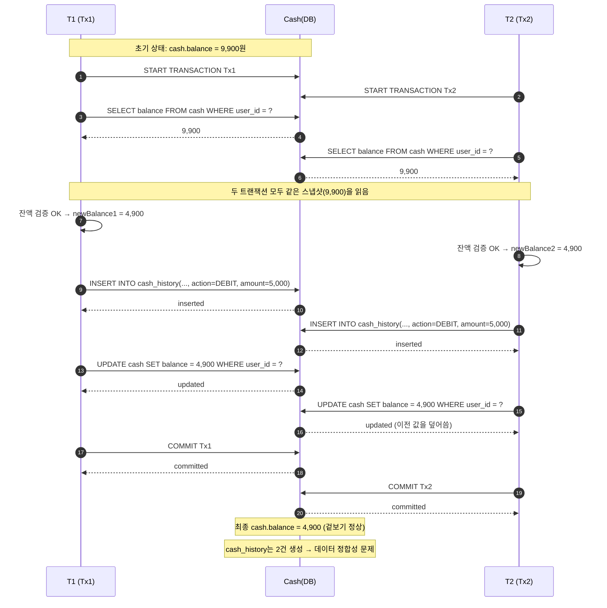

# [동시성 이슈별 해결 전략] Cash

## 목차

- [1. 동일 사용자의 동시 결제 요청으로 인한 잔액 음수 오류](#1-동일-사용자의-동시-결제-요청으로-인한-잔액-음수-오류)
    - [1-1. 문제 상황](#1-1-문제-상황)
    - [1-2. 테스트 결과](#1-2-테스트-결과)
- [2. 사용자 주문과 관리자의 잔액 차감 동시 발생](#2-사용자-주문과-관리자의-잔액-차감이-동시에-발생)
    - [2-1. 문제 상황](#2-1-문제-상황)
    - [2-2. 문제 원인 분석](#2-2-문제-원인-분석)
    - [2-3. 해결 전략 및 적용](#2-3-해결-전략-및-적용)
        - [2-3-1. 해결 전략](#2-3-1-해결-전략)
        - [2-3-2. 적용](#2-3-2-적용)
    - [2-4. 적용 결과](#2-4-적용-결과)

## 1. 동일 사용자의 동시 결제 요청으로 인한 잔액 음수 오류

### 1-1. 문제 상황

잔액이 9,900원을 보유하고 있는 유저가 5,000원 상품 A,B를 동시에 주문 및 결제한 상황을 테스트 코드로 작성했습니다.

#### Test code

[CashConcurrencyIntegrationTest.java](../../src/test/java/kr/hhplus/be/commerce/application/cash/CashConcurrencyIntegrationTest.java)

```java
class CashConcurrencyIntegrationTest extends AbstractIntegrationTestSupport {
	/**
	 * 작성 이유: 동일 사용자의 여러 주문 요청이 동시에 발생할 때,
	 * 잔액 검증의 Race condition으로 인한 음수 잔액 발생 여부를 검증합니다.
	 */
	@IntegrationTest
	void 동일_사용자가_여러_상품을_동시에_주문할_때_잔액이_부족하면_예외를_발생시킨다() throws InterruptedException {
		// given
		final int threadCount = 2;
		final BigDecimal balance = BigDecimal.valueOf(9_900);
		UserEntity user = userJpaRepository.save(UserEntity.builder()
			.email("userA@gmail.com")
			.encryptedPassword("encrypted_password")
			.status(UserStatus.ACTIVE)
			.build());

		final Long userId = user.getId();
		cashJpaRepository.save(
			CashEntity.fromDomain(Cash.restore(
				null,
				userId,
				balance,
				0L
			)));

		Product productA = productJpaRepository.save(ProductEntity.builder()
			.name("오뚜기 진라면 매운맛 120g")
			.price(BigDecimal.valueOf(5_000))
			.stock(1)
			.build()).toDomain();

		Product productB = productJpaRepository.save(ProductEntity.builder()
			.name("스타벅스 아메리카노")
			.price(BigDecimal.valueOf(5_000))
			.stock(1)
			.build()).toDomain();

		List<Product> products = List.of(productA, productB);

		CountDownLatch countDownLatch = new CountDownLatch(threadCount);
		ExecutorService executorService = Executors.newFixedThreadPool(threadCount);

		// when
		IntStream.range(0, threadCount)
			.forEach((index) -> executorService.execute(() -> {
				try {
					orderPlaceProcessor.execute(generateCommand(userId, products.get(index)));
				} catch (Exception e) {
				} finally {
					countDownLatch.countDown();
				}
			}));

		countDownLatch.await();

		// then
		CashEntity cash = cashJpaRepository.findByUserId(userId)
			.orElseThrow();

		assertThat(cash.getBalance().compareTo(BigDecimal.valueOf(4_900))).isZero()
			.as("처음 주문한 상품만 결제가 가능해야 한다.");
	}
}

```

#### Business code

[OrderPlaceProcessor.java](../../src/main/java/kr/hhplus/be/commerce/application/order/OrderPlaceProcessor.java)

### 1-2. 테스트 결과

user 테이블의 primary key값을 기준으로 비관적 잠금을 획득하고 있기 때문에, 스레드는 순차적으로 접근하게 됩니다. 따라서 동시성 이슈가 발생하지 않음을 확인했습니다.

## 2. 사용자 주문과 관리자의 잔액 차감 동시 발생

### 2-1. 문제 상황

사용자 A가 잔액 9,900원을 보유하고 있습니다.
사용자 A가 5,000원 상품을 구매하는 동시에 어드민에서 사용자 A의 잔액 5,000원을 차감합니다.
이 때, 결제가 실패할 경우든, 어드민 잔액 차감이 실패할 경우든, 사용자의 잔액은 4,900원이 남아야 합니다.

하지만, 아래의 Test code를 수행해보면
기대값과 동일하게 잔액은 4,900원이 남지만 실패 케이스가 발생하지 않고 잔액 내역에는 둘 다 남으면서 데이터 정합성에 문제가 발생했습니다.

#### Test code

[CashConcurrencyIntegrationTest.java](../../src/test/java/kr/hhplus/be/commerce/application/cash/CashConcurrencyIntegrationTest.java)

```java
class CashConcurrencyIntegrationTest extends AbstractIntegrationTestSupport {
	/**
	 * 작성 이유: 공유 자원인 Cash에 서로 다른 요청인 사용자 주문과 어드민 잔액 차감 요청이 동시에 들어왔을 때
	 * 잔액이 음수가 되는지 검증하기 위해 작성했습니다.
	 *
	 * 사용자 보유 잔액: 9,900원
	 * 주문 상품 가격: 5,000원
	 * 어드민 잔액 차감 금액: 5,000원
	 * 예상 결과: 4,900원이 남고 하나의 요청은 예외 발생시킴.
	 */
	@IntegrationTest
	void 사용자_주문과_관리자의_잔액_차감이_동시에_발생했을_때_잔액이_부족할_경우_예외를_발생시킨다() throws InterruptedException {
		// given
		final int threadCount = 2;
		final BigDecimal balance = BigDecimal.valueOf(9_900);
		final BigDecimal productPrice = BigDecimal.valueOf(5_000);
		final BigDecimal deductionBalance = BigDecimal.valueOf(5_000);
		UserEntity user = userJpaRepository.save(UserEntity.builder()
			.email("userA@gmail.com")
			.encryptedPassword("encrypted_password")
			.status(UserStatus.ACTIVE)
			.build());

		final Long userId = user.getId();
		cashJpaRepository.save(
			CashEntity.fromDomain(Cash.restore(
				null,
				userId,
				balance,
				0L
			)));

		Product product = productJpaRepository.save(ProductEntity.builder()
			.name("오뚜기 진라면 매운맛 120g")
			.price(productPrice)
			.stock(1)
			.build()).toDomain();

		CountDownLatch countDownLatch = new CountDownLatch(threadCount);
		ExecutorService executorService = Executors.newFixedThreadPool(threadCount);
		AtomicInteger successCount = new AtomicInteger(0);
		AtomicInteger failureCount = new AtomicInteger(0);
		List<Exception> exceptions = new ArrayList<>();

		// when
		// 사용자가 상품을 주문합니다.
		executorService.execute(() -> {
			try {
				orderPlaceProcessor.execute(generateCommand(userId, product));
				successCount.incrementAndGet();
			} catch (Exception e) {
				exceptions.add(e);
				failureCount.incrementAndGet();
			} finally {
				countDownLatch.countDown();
			}
		});

		// 어드민이 사용자의 잔액을 차감합니다.
		executorService.execute(() -> {
			try {
				cashDeductAdminProcessor.execute(new CashDeductAdminProcessor.Command(userId, deductionBalance));
				successCount.incrementAndGet();
			} catch (Exception e) {
				exceptions.add(e);
				failureCount.incrementAndGet();
			} finally {
				countDownLatch.countDown();
			}
		});

		countDownLatch.await();

		// then
		CashEntity cash = cashJpaRepository.findByUserId(userId)
			.orElseThrow();
		List<CashHistoryEntity> cashHistories = cashHistoryJpaRepository.findAllByUserId(userId);

		assertThat(successCount.get()).isEqualTo(1)
			.as("사용자 주문 혹은 어드민 잔액 차감 둘 중에 하나만 성공해야 한다.");
		assertThat(failureCount.get()).isEqualTo(1)
			.as("사용자 주문 혹은 어드민 잔액 차감 둘 중에 하나만 실패해야 한다.");
		assertThat(exceptions.size()).isEqualTo(1);
		assertThat(exceptions.get(0)).isInstanceOf(CommerceException.class)
			.hasMessage("잔액이 부족합니다. 잔액을 충전해주세요.");

		assertThat(cash.getBalance()).isEqualByComparingTo(BigDecimal.valueOf(4_900))
			.as("사용자 주문 혹은 어드민 잔액 차감 중에 하나만 성공하여 잔액은 4,900원이 남아야 한다.");
		assertThat(cashHistories.size()).isEqualTo(1);
	}
}
```

#### 테스트 결과

| 회차 | 예상 결과                                    | 실제 결과                                    |
|:--:|------------------------------------------|------------------------------------------|
| 1회 | 잔액: 4,900, <br/> cashHistories.size(): 1 | 잔액: 4,900, <br/> cashHistories.size(): 2 |
| 2회 | 잔액: 4,900, <br/> cashHistories.size(): 1 | 잔액: 4,900, <br/> cashHistories.size(): 2 |
| 3회 | 잔액: 4,900, <br/> cashHistories.size(): 1 | 잔액: 4,900, <br/> cashHistories.size(): 2 |

### 2-2. 문제 원인 분석



1. 동시성 문제 중 `Lost Update Problem`이 발생했습니다.
   동일한 `cash` 테이블의 레코드(초기 잔액 9,900원)에 대해 두 개의 트랜잭션이 동시에 접근하여 수정을 하면서, 트랜잭션에서 다른 트랜잭션의 업데이트 결과를 덮어씌웠습니다. 결과값이 예상값과 동일하지만
   실제로 서로 다른 금액으로 잔액을 차감했을 경우에는 결과값과 예상값이 달라지게 됩니다.
2. 하나의 트랜잭션만 성공할 것이라는 예상과 달리, 두 개의 트랜잭션이 성공하면서 `cash_history`에 두 개의 레코드가 생성되는 데이터 정합성 문제도 함께 발생했습니다.

### 2-3. 해결 전략 및 적용

#### 2-3-1. 해결 전략

|       잠금 방식        | 채택 여부 | 이유                                                                                      |
|:------------------:|-------|-----------------------------------------------------------------------------------------|
|       낙관적 락        | ✅     | 특정 사용자의 잔액 변경에 대한 충돌 발생 가능성은 현저히 낮기 때문에 채택했습니다.                                         |
| 비관적 락 (FOR UPDATE) | ❌     | 충돌 발생 가능성이 높고 데이터 정합성이 중요한 상황에 적합합니다. 잔액 변경은 충돌 가능성히 현저히 낮기 때문에 비관적 락은 적합하지 않다고 생각했습니다. 
|       네임드 락        | ❌     | 낙관적 락으로 충분히 해결 가능합니다. 네임드 락은 별도 커넥션 관리와 타임아웃 처리가 필요하기 때문에 복잡도가 높아집니다.                   |

#### 2-3-2. 적용

##### `cash` table에 version column 추가 및 CashEntity에 version field 추가

```sql
create table cash
(
    # ...
    version bigint not null default 0 comment '동시성 제어 위함'
    # ...
);
```

```java
public class CashEntity extends BaseTimeEntity {
	// ...
	@Version
	private Long version;
	// ...
}
```

##### `CashDeductAdminProcessor`에 동시성 이슈 발생 시, @Retryable + @Recover 추가

```java

@Service
@RequiredArgsConstructor
@Slf4j
public class CashDeductAdminProcessor {
	private final CashRepository cashRepository;
	private final CashHistoryRepository cashHistoryRepository;

	/**
	 * 어드민에 의해서 사용자의 잔액을 차감시키는 프로세서입니다.
	 */
	@Retryable(
		retryFor = {
			// 낙관적 락 충돌 시 발생합니다.
			OptimisticLockingFailureException.class,
			// 비관적 락 획득 실패 시 발생합니다.
			PessimisticLockingFailureException.class
		},
		maxAttempts = 3,
		backoff = @Backoff(delay = 100)
	)
	@Transactional
	public Output execute(Command command) {
		Cash deductedCash = cashRepository.findByUserId(command.userId)
			.orElseThrow(() -> new CommerceException(CommerceCode.NOT_FOUND_USER))
			.use(command.deductionBalance);

		return new Output(
			cashRepository.save(deductedCash),
			cashHistoryRepository.save(
				CashHistory.recordOfDeduct(command.userId, deductedCash.balance(), command.deductionBalance)
			)
		);
	}

	@Recover
	public Output recover(RuntimeException e, Command command) {
		if (e instanceof OptimisticLockingFailureException) {
			log.error("Exceeded retry count for optimistic lock, command={}", command, e);
			throw new CommerceException(CommerceCode.EXCEEDED_RETRY_COUNT_FOR_LOCK);
		}
		if (e instanceof PessimisticLockingFailureException) {
			log.error("Exceeded retry count for pessimistic lock, command={}", command, e);
			throw new CommerceException(CommerceCode.EXCEEDED_RETRY_COUNT_FOR_LOCK);
		}
		throw e;
	}

	public record Command(
		Long userId,
		BigDecimal deductionBalance
	) {
	}

	public record Output(
		Cash cash,
		CashHistory cashHistory
	) {
	}
}

```

##### `OrderPlaceProcessor`에 동시성 이슈 발생 시, @Retryable + @Recover

```java

@Slf4j
@RequiredArgsConstructor
public class OrderPlaceProcessor {
	// ...

	@Retryable(
		retryFor = {
			OptimisticLockingFailureException.class,
			PessimisticLockingFailureException.class
		},
		maxAttempts = 3,
		backoff = @Backoff(delay = 100)
	)
	@Transactional
	public Output execute(Command command) {
		// ...
	}

	@Recover
	public Output recover(RuntimeException e, Command command) {
		if (e instanceof OptimisticLockingFailureException) {
			log.error("Exceeded retry count for optimistic lock, command={}", command, e);
			throw new CommerceException(CommerceCode.EXCEEDED_RETRY_COUNT_FOR_LOCK);
		}
		if (e instanceof PessimisticLockingFailureException) {
			log.error("Exceeded retry count for pessimistic lock, command={}", command, e);
			throw new CommerceException(CommerceCode.EXCEEDED_RETRY_COUNT_FOR_LOCK);
		}
		throw e;
	}

}

```

### 2-4. 적용 결과

| 회차 | 예상 결과                                    | 실제 결과                                    |
|:--:|------------------------------------------|------------------------------------------|
| 1회 | 잔액: 4,900, <br/> cashHistories.size(): 1 | 잔액: 4,900, <br/> cashHistories.size(): 1 |
| 2회 | 잔액: 4,900, <br/> cashHistories.size(): 1 | 잔액: 4,900, <br/> cashHistories.size(): 1 |
| 3회 | 잔액: 4,900, <br/> cashHistories.size(): 1 | 잔액: 4,900, <br/> cashHistories.size(): 1 |
