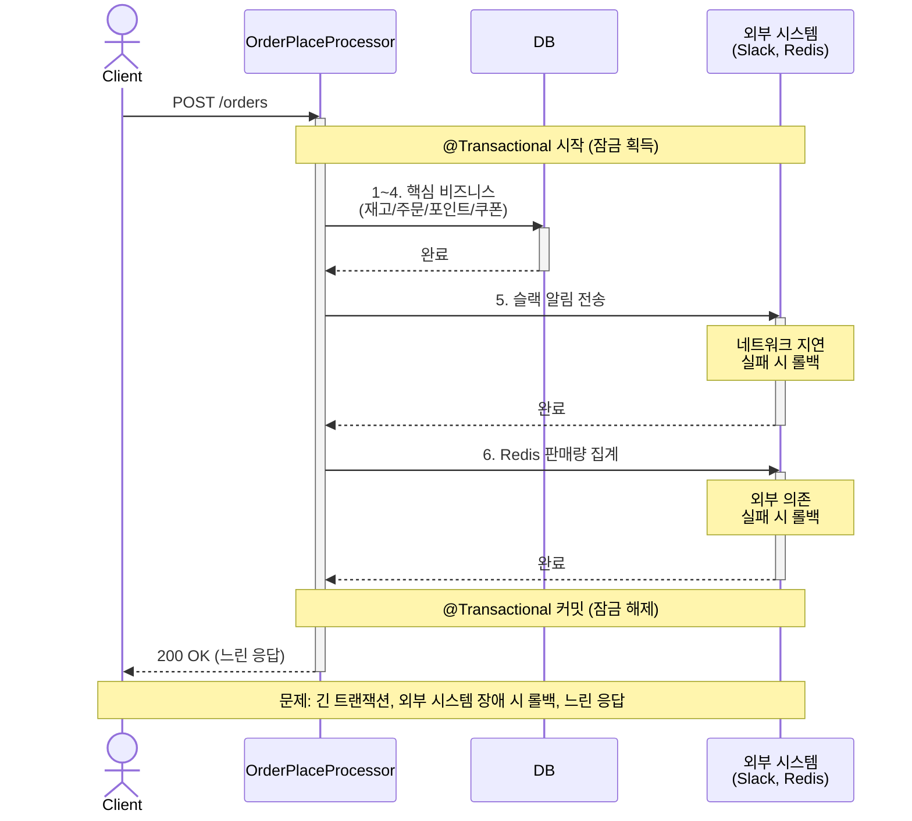
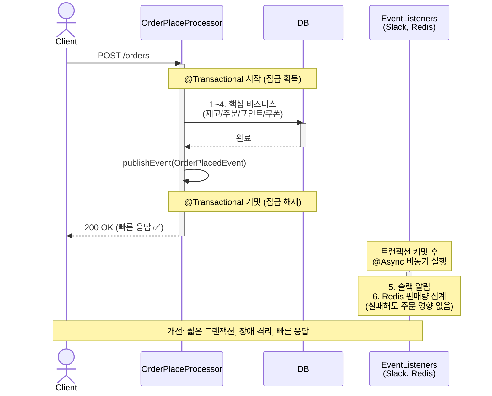

# 주문 및 결제 시스템의 이벤트 기반 리팩토링

## 1. 문제 정의 (AS-IS)

### 1.1 문제 상황

현재 주문/결제 시스템은 하나의 트랜잭션 내에서 핵심 비즈니스 로직과 부가 기능을 모두 동기적으로 처리하고 있습니다.

```java
public class OrderPlaceProcessor {
	@Transactional
	public void execute(Command command) {
		// 1. 재고 차감 (핵심)
		// 2. 주문 상태 변경 (핵심)
		// 3. 포인트 차감 (핵심)
		// 4. 쿠폰 사용 (핵심)
		// 5. 슬랙 알림 메시지 전송 (부가)
		// 6. Redis 판매량 집계 (부가)
	}
}
```

### 1.2 구체적인 문제점

#### 1.2.1 긴 트랜잭션으로 인한 동시성 저하

하나의 트랜잭션 내에서 동시성 제어를 위해 잠금을 획득한 상태에서 너무 많은 작업을 수행합니다. 이로 인해 해당 자원에 접근하는 다른 요청들이 대기하거나 데드락 상황을 유발할 수 있습니다.

#### 1.2.2 외부 시스템에 대한 의존성

트랜잭션 범위 내에 데이터베이스와 무관한 외부 시스템(Slack, Redis)을 포함하고 있습니다. 외부 시스템의 네트워크 지연이나 예외 발생 시 전체 트랜잭션이 롤백되어 핵심 비즈니스까지 실패하게 됩니다.

#### 1.2.3 느린 응답 시간

클라이언트는 모든 작업(핵심 + 부가)이 완료될 때까지 대기해야 하므로, 불필요하게 긴 응답 시간이 발생합니다.

### 1.3 AS-IS 처리 흐름



---

## 2. 해결 방안 (TO-BE)

### 2.1 핵심 개선 전략

**핵심 비즈니스 로직과 부가 비즈니스 로직을 분리하여, 부가 로직을 이벤트 기반 아키텍처로 비동기 처리합니다.**

- **핵심 비즈니스 로직**: 재고 차감, 주문 상태 변경, 포인트 차감, 쿠폰 사용
- **부가 비즈니스 로직**: 슬랙 알림 전송, Redis 판매량 집계

### 2.2 이벤트 기반 아키텍처 적용

#### 2.2.1 이벤트 발행

주문/결제가 완료되면 `OrderPlacedEvent`를 발행합니다.

```java
public class OrderPlaceWithEventProcessor implements OrderPlaceProcessor {

	@Transactional
	public Output execute(Command command) {
		// 1. 핵심 비즈니스 로직 처리
		// - 재고 차감
		// - 주문 상태 변경
		// - 포인트 차감
		// - 쿠폰 사용

		// 2. 이벤트 발행
		internalEventPublisher.publishEvent(new OrderPlacedEvent(order.id()));

		return output;
	}
}
```

#### 2.2.2 이벤트 리스너 구현

트랜잭션 커밋 이후 비동기로 부가 로직을 처리하는 EventListener를 구현합니다.

**슬랙 알림 리스너**

```java

@Service
@RequiredArgsConstructor
@Slf4j
public class OrderPlacedNotificationEventListener {
	private final SlackSendMessageClient slackSendMessageClient;

	@Async
	@TransactionalEventListener(phase = TransactionPhase.AFTER_COMMIT)
	public void handle(OrderPlacedEvent event) {
		try {
			log.debug("[OrderPlacedNotificationEventListener] Thread={}",
				Thread.currentThread().getName());

			String message = String.format(
				"[주문 확정🎉] orderId=%s, 주문 확정 일시=%s",
				event.orderId(),
				event.occurredAt()
			);

			slackSendMessageClient.send(message);
		} catch (Exception e) {
			log.error("슬랙 메시지 전송 중 에러 발생", e);
		}
	}
}
```

**판매량 집계 리스너**

```java

@Service
@RequiredArgsConstructor
@Slf4j
public class OrderPlacedProductRankingEventListener {
	private final ProductRankingStore productRankingStore;

	@Async
	@TransactionalEventListener(phase = TransactionPhase.AFTER_COMMIT)
	public void handle(OrderPlacedEvent event) {
		try {
			log.debug("[+OrderPlacedProductRankingEventListener] 진입: Thread={}", Thread.currentThread().getName());
			LocalDateTime now = event.occurredAt();
			LocalDate today = now.toLocalDate();

			event.orderLines()
				.forEach(
					(orderLine) -> productRankingStore.increment(orderLine.productId(), orderLine.orderQuantity(),
						today,
						now));
		} catch (Exception e) {
			log.error("[알수 없는 에러 발생] 주문 확정 이후, 판매량을 증가시키는데 에러가 발생헀습니다.", e);
		}
	}

}
```

### 2.3 TO-BE 처리 흐름



---

## 3. 개선 효과

### 3.1 주요 개선 사항

| 항목          | AS-IS                  | TO-BE             |
|-------------|------------------------|-------------------|
| **트랜잭션 범위** | 모든 작업 포함 (1~6)         | 핵심 비즈니스만 (1~4)    |
| **잠금 시간**   | 외부 시스템 호출까지 포함         | 핵심 DB 작업만 포함      |
| **응답 시간**   | 모든 작업 완료 후 응답          | 핵심 로직 완료 후 즉시 응답  |
| **장애 영향**   | 외부 시스템 실패 시 전체 롤백      | 외부 시스템 실패 격리      |
| **확장성**     | 새 기능 추가 시 Processor 수정 | EventListener만 추가 |
| **테스트**     | 모든 의존성 필요              | 관심사별 독립 테스트 가능    |

### 3.2 이벤트 기반 아키텍처의 장점

#### 3.2.1 트랜잭션 최적화

- 핵심 비즈니스 로직만 트랜잭션에 포함하여 잠금 시간 단축
- 동시성 향상 및 데드락 위험 감소

#### 3.2.2 장애 격리

- 외부 시스템 장애가 핵심 비즈니스에 영향을 주지 않음
- 각 EventListener가 독립적으로 예외 처리 가능

#### 3.2.3 빠른 응답 시간

- 클라이언트는 핵심 로직 완료 즉시 응답 받음
- 부가 기능은 백그라운드에서 비동기 처리

#### 3.2.4 높은 확장성

- 새로운 후속 처리 추가 시 EventListener만 추가하면 됨
- 기존 주문 로직 변경 불필요

#### 3.2.5 테스트 용이성

- 주문 로직과 부가 로직을 독립적으로 테스트 가능
- 단위 테스트 작성이 더 간단해짐
- 통합 테스트 작성은 비동기 -> 동기적 후처리로 변경 후 진행
  ([OrderPlaceWithEventProcessorIntegrationTest.java](../../src/test/java/kr/hhplus/be/commerce/application/order/OrderPlaceWithEventProcessorIntegrationTest.java))

---

## 4. 결론

이벤트 기반 아키텍처를 도입하여 핵심 비즈니스 로직과 부가 기능을 분리함으로써 아래와 같은 이점을 얻을 수 있었습니다.

1. **성능 개선**: 트랜잭션 최적화로 동시성 향상 및 응답 시간 단축
2. **안정성 향상**: 외부 시스템 장애로부터 핵심 비즈니스 보호
3. **유지보수성 개선**: 관심사 분리로 코드 변경 영향 범위 최소화
4. **확장성 확보**: 새로운 기능 추가 시 기존 코드 수정 불필요

이를 통해 더 견고하고 확장 가능한 주문/결제 시스템을 구축할 수 있습니다.
