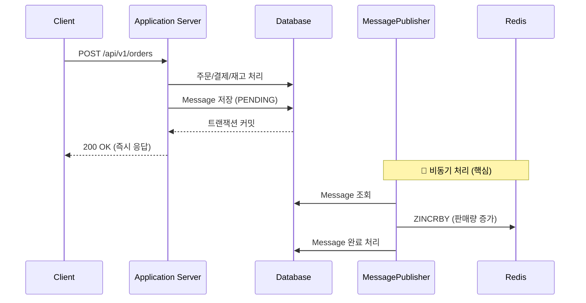
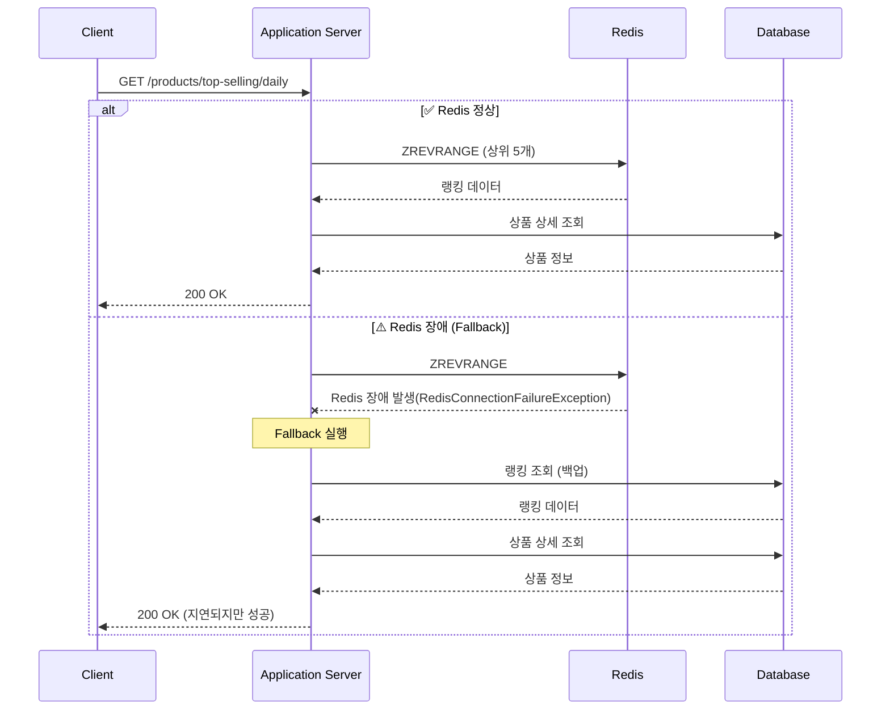

# 일간 상품 랭킹 시스템 설계 및 회고

## 1. 개요

### 1.1 목적

이커머스 서비스에서 실시간으로 일간 판매량 기준 상위 5개 상품을 조회할 수 있는 랭킹 시스템을 설계 및 구현합니다.

### 1.2 요구사항

- 주문이 확정될 때마다 실시간으로 상품 판매량을 집계
- 일간 판매량 기준 TOP 5 상품 조회 API 제공
- 대용량 트래픽에서도 빠른 응답 속도 보장
- Redis 장애 시에도 서비스 지속 가능 (Fallback 전략)
- Redis -> Database 상품 랭킹 동기화

---

## 2. 핵심 기능 설계 및 구현

### 2.1 주문 시 판매량 업데이트 (비동기 처리)

#### 시퀀스 다이어그램



#### 구현 코드

**OrderConfirmedMessagePublisher.java**

```java
@Override
public void publish(OrderConfirmedMessagePayload messagePayload) {
	// 1. 외부 시스템 연동 (Slack 알림)
	slackSendMessageClient.send(messagePayload.toString());

	// 2. 주문 정보 조회
	Order order = orderRepository.findById(messagePayload.orderId())
		.orElseThrow(() -> new CommerceException(CommerceCode.NOT_FOUND_ORDER));

	// 3. Redis에 상품 판매량 증가
	LocalDateTime now = LocalDateTime.now();
	order.orderLines()
		.forEach(orderLine ->
			productRankingStore.increment(
				orderLine.productId(),
				orderLine.orderQuantity(),
				messagePayload.today(),
				now
			)
		);
}
```

#### 핵심 포인트

- **성능**: 주문 처리와 Redis 업데이트가 분리되어 빠른 응답 제공
- **안정성**: Redis 장애가 주문 트랜잭션에 영향 없음
- **재처리**: 외부 시스템(Slack, Redis) 장애 시 Message 테이블 기반 재시도 가능

### 2.2 일간 TOP 5 상품 조회 (Fallback 전략)

#### 시퀀스 다이어그램



#### 구현 코드

**ProductReadAllDailyTopSellingQueryManager.java**

```java
private List<Long> readProductIdsDailyTopSelling(Query query) {
	try {
		// 1차: Redis에서 조회 (빠른 응답)
		return productRankingStore.readProductIdsDailyTopSelling(query.today, query.limit)
			.stream()
			.map(ProductRankingView::productId)
			.toList();
	} catch (Exception e) {
		// 2차: Redis 장애 시 Database에서 조회 (안정성)
		return productRankingReader.readProductIdsByRankingDateOrderBySalesCountDesc(
			query.today, query.limit
		);
	}
}
```

#### 핵심 포인트

- **정상 상황**: Redis에서 빠른 조회 (< 10ms)
- **장애 상황**: Database Fallback으로 서비스 지속 (약간 느림)
- **높은 가용성**: Redis 장애 시에도 무중단 서비스 가능

### 2.3 Redis Sorted Set을 활용한 랭킹 관리

**ProductRankingStoreImpl.java**

```java
@Override
	public void increment(Long productId, Integer salesCount, LocalDate rankingDate, LocalDateTime now) {
		final String key = productRankingKeyGenerator.generate(rankingDate);

		redisTemplate.opsForZSet()
			.incrementScore(key, String.valueOf(productId), salesCount);

		// FIXME: 11/18/25 increment method 호출 시마다 setIfAbsent method를 호출해 레디스 커넥션을 하나 더 사용하는 비용이 불필요한 것 같습니다.
		//  다른 방법은 없는지 고민이 됩니다.
		setTtlIfAbsent(key, rankingDate, now);

	}

```

**핵심 전략:**

- **ZINCRBY**: 원자적 연산으로 동시성 문제 해결
- **자동 TTL 설정**: 일간 랭킹은 다음날 01:00에 자동 삭제되어 메모리 효율 확보
- **O(log N) 성능**: Sorted Set의 로그 시간 복잡도로 빠른 처리

### 2.4 주기적 동기화 (Redis → Database)

**ProductRankingSynchronizeScheduler.java**

```java
/**
 * Redis의 실시간 상품 판매량을 Database(product_ranking)에 동기화합니다.
 * 직전 스케줄러가 끝나고 5분 뒤에 동작합니다.
 */
@Scheduled(fixedDelay = FIVE_MINUTES)
public void synchronizeToday() {
	synchronize(timeProvider.today());
}

/**
 * 어제 집계가 완료된 Redis의 상품 판매량을 Database(product_ranking)에 동기화합니다.
 * 매일 00:01분에 스케줄러가 동작합니다.
 */
@Scheduled(cron = "0 1 0 * * *")
public void synchronizeYesterday() {
	final LocalDate yesterday = timeProvider.today().minusDays(1);
	synchronize(yesterday);
}

private void synchronize(LocalDate rankingDate) {
	try {
		// 1. Redis에서 현재 랭킹 조회
		List<ProductRankingView> currentRankings =
			productRankingStore.readProductIdsDailyTopSelling(rankingDate);

		// 2. Database에서 기존 랭킹 조회
		Map<Long, ProductRanking> previousRankingMap =
			productRankingRepository.findAllByRankingDate(rankingDate)
				.stream()
				.collect(Collectors.toMap(ProductRanking::productId, it -> it));

		// 3. 동기화 후 저장
		productRankingRepository.saveAll(synchronize(currentRankings, previousRankingMap));

	} catch (RedisConnectionFailureException e) {
		log.error("[레디스 시스템 다운] 상품 판매량 랭킹 동기화 작업 실패", e);
	} catch (RedisCommandTimeoutException e) {
		log.error("[레디스 요청 타임아웃] 상품 판매량 랭킹 동기화 작업 실패", e);
	} catch (Exception e) {
		log.error("[알 수 없는 예외] 상품 판매량 랭킹 동기화 작업 실패", e);
	}
}
```

**동기화 전략:**

- **실시간 동기화**: 5분 주기로 오늘 데이터 동기화 (`synchronizeToday`)
- **일간 동기화**: 매일 00:01에 어제 데이터 최종 동기화 (`synchronizeYesterday`)
- **목적**: Fallback 전략을 위한 Database 최신화 및 Redis 데이터 유실 대비

### 2.5 Redis 장애 복구 프로세스

**ProductRankingRecoverAdminProcessor.java**

```java
@Transactional
public void execute(Command command) {
	// 1. Database에서 당일 주문 전체 조회
	List<Order> orders = orderRepository.findAllDailyConfirmed(command.today);

	// 2. 상품별 판매량 집계
	Map<Long, Integer> productIdToSalesCountMap = orders.stream()
		.map(Order::orderLines)
		.flatMap(List::stream)
		.collect(Collectors.toMap(
			OrderLine::productId,
			OrderLine::orderQuantity,
			Integer::sum
		));

	// 3. Database에 복구된 랭킹 저장
	productRankingRepository.saveAll(recoveredRankings);

	// 4. 비동기 메시지 발행 (Redis 복구용)
	messageRepository.save(Message.ofPending(
		0L,
		MessageTargetType.PRODUCT_RANKING,
		ProductRankingRecoveredMessagePayload.from(command.today)
	));
}
```

**복구 전략:**

- 주문 데이터를 기반으로 랭킹 재계산
- Database 먼저 복구 후 Redis 비동기 복구
- 관리자 API를 통한 수동 복구

---

## 3. 기술적 의사결정

### 3.1 Redis Sorted Set 선택 이유

| 비교 항목   | Redis Sorted Set       | Database                     |
| ----------- | ---------------------- | ---------------------------- |
| 조회 성능   | O(log N) - 매우 빠름   | O(N log N) - 상대적으로 느림 |
| 쓰기 성능   | O(log N) - 원자적 증가 | O(1) + Lock 대기 시간        |
| 동시성 처리 | 원자적 연산 지원       | Lock 필요 (경합 발생)        |
| 메모리 효율 | TTL로 자동 관리        | 지속적 증가                  |
| 가용성      | 장애 시 Fallback 필요  | 높은 안정성                  |

**결론**: 실시간성과 성능이 중요한 랭킹 시스템에 적합

### 3.2 비동기 메시징 패턴 선택 이유

**동기 방식의 문제점:**

- Redis 장애 시 주문 트랜잭션 실패
- Slack 알림 지연 시 주문 지연
- 외부 시스템 의존성 증가

**비동기 방식의 장점:**

- 주문 처리 성능 향상 (응답 시간 단축)
- 외부 시스템 장애 격리
- 재시도 가능한 구조 (Message 테이블 기반)

### 3.3 5분 동기화 주기 선택 근거

- **너무 짧으면**: Database 부하 증가, 동기화 오버헤드
- **너무 길면**: Fallback 시 데이터 신선도 저하
- **5분 선택**: 실시간성과 효율성의 균형점

### 3.4 Redis TTL을 다음날 01:00로 설정한 이유

- **어제 데이터 최종 동기화 보장**: 매일 00:01에 `synchronizeYesterday()` 스케줄러가 어제 데이터를 Database에 동기화합니다.
- **복구 시간 확보**: 스케줄러 실패 시 관리자가 수동으로 복구할 수 있는 여유 시간(약 1시간)을 제공합니다.
- **데이터 유실 방지**: Redis에서 데이터가 삭제되기 전에 Database 동기화를 완료할 수 있도록 보장합니다.

---

## 4. 회고

### 4.1 잘된 점 (Keep)

#### 4.1.1 비동기 메시징 패턴 도입

- **주문 처리 성능 향상**: 외부 시스템(Redis, Slack)과의 결합도를 낮춰 주문 응답 시간이 단축되었습니다.
- **장애 격리**: Redis나 Slack 장애가 주문 트랜잭션에 영향을 주지 않아 시스템 안정성이 크게 향상되었습니다.
- **재시도 가능한 구조**: Message 테이블을 통해 실패한 메시지를 추적하고 재처리할 수 있어 데이터 정합성을 보장할 수 있었습니다.

#### 4.1.2 Fallback 전략

- **높은 가용성**: Redis 장애 시에도 Database를 통해 서비스를 지속할 수 있어 무중단 서비스가 가능했습니다.
- **점진적 성능 저하**: 장애 시 완전히 실패하는 것이 아니라 성능이 약간 저하되는 수준으로 대응할 수 있었습니다.

#### 4.1.3 Redis Sorted Set 활용

- **효율적인 랭킹 관리**: O(log N) 시간 복잡도로 실시간 랭킹 업데이트와 조회가 매우 빠릅니다.
- **원자적 연산**: ZINCRBY를 통해 별도의 Lock 없이도 동시성 문제를 해결할 수 있었습니다.
- **자동 메모리 관리**: TTL 설정으로 일간 데이터가 자동으로 만료되어 메모리 관리가 용이했습니다.

### 4.2 아쉬운 점 (Problem)

#### 4.2.1 TTL 설정의 비효율성

- **현재 구현**: `increment` 메서드 호출 시마다 `setTtlIfAbsent`를 호출하여 불필요한 Redis 커넥션을 추가로 사용합니다.

```java
// 매번 호출되는 비효율적인 코드
public void increment(Long productId, Integer salesCount, LocalDate rankingDate, LocalDateTime now) {
	redisTemplate.opsForZSet().incrementScore(key, String.valueOf(productId), salesCount);
	setTtlIfAbsent(key, rankingDate, now);  // ← 매번 확인
}
```

- **개선 필요**: 캐시나 Lua Script를 활용하여 TTL 설정을 한 번만 수행하도록 최적화가 필요합니다.

#### 4.2.2 동기화 주기의 딜레마

- **5분 주기**: 실시간성과 효율성 사이의 타협점이지만, Fallback 시 최대 5분간의 데이터 차이가 발생할 수 있습니다.
- **고려사항**: 비즈니스 요구사항에 따라 동기화 주기를 동적으로 조정하는 전략이 필요할 수 있습니다.

#### 4.2.3 복구 프로세스의 수동 실행

- Redis 장애 복구 시, 관리자가 수동으로 API를 호출해야 합니다.
- Health Check를 통해 Redis 복구 감지 시 자동으로 복구 프로세스를 실행하는 방안을 고려할 수 있습니다.

### 4.3 배운 점 (Learned)

#### 4.3.1 아키텍처 설계의 중요성

- 시스템을 처음부터 비동기로 설계한 것이 확장성과 안정성에 큰 도움이 되었습니다.
- 외부 의존성(Redis, Slack)을 격리한 설계가 장애 전파를 막는 데 효과적이었습니다.

#### 4.3.2 적절한 기술 선택

- Redis Sorted Set은 랭킹 시스템에 최적화된 자료구조임을 확인했습니다.
- Database와 Redis의 역할을 명확히 분리(안정성 vs 성능)한 것이 효과적이었습니다.

#### 4.3.3 운영 관점의 중요성

- Fallback 전략, 모니터링, 복구 프로세스 등 운영 관점을 초기부터 고려한 것이 중요했습니다.
- 예외 처리와 로깅을 상세히 구현하여 문제 발생 시 빠른 대응이 가능했습니다.

---

## 5. 결론

Redis 기반 일간 상품 랭킹 시스템을 통해 다음과 같은 목표를 달성했습니다:

✅ **실시간성**: Redis Sorted Set을 활용하여 빠른 랭킹 조회 (< 10ms)  
✅ **확장성**: 비동기 메시징 패턴으로 주문 처리 성능 향상  
✅ **안정성**: Fallback 전략으로 Redis 장애 시에도 서비스 지속  
✅ **운영 효율**: 주기적 동기화 및 관리자 수동 복구 프로세스 구현

향후 트래픽 증가 및 비즈니스 요구사항 변화에 따라 Lua Script 활용, 샤딩 전략, 자동 복구 프로세스 등을 점진적으로 개선해 나갈 예정입니다.
