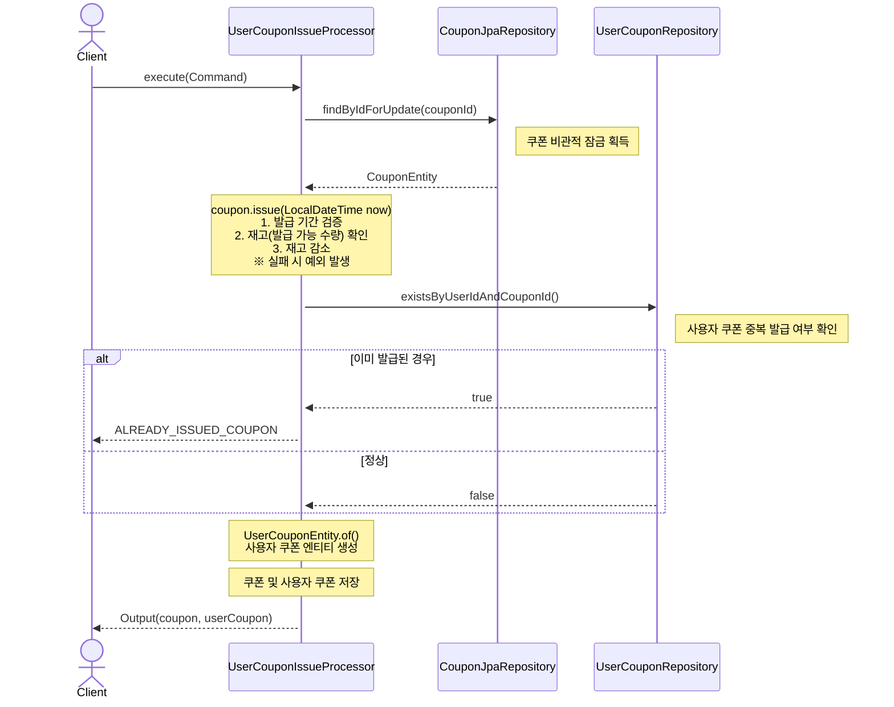
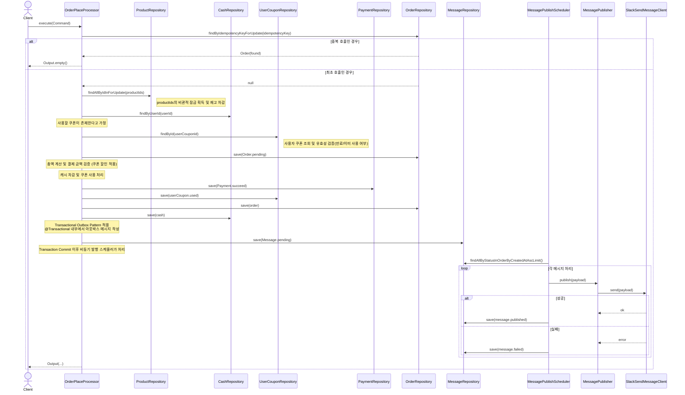
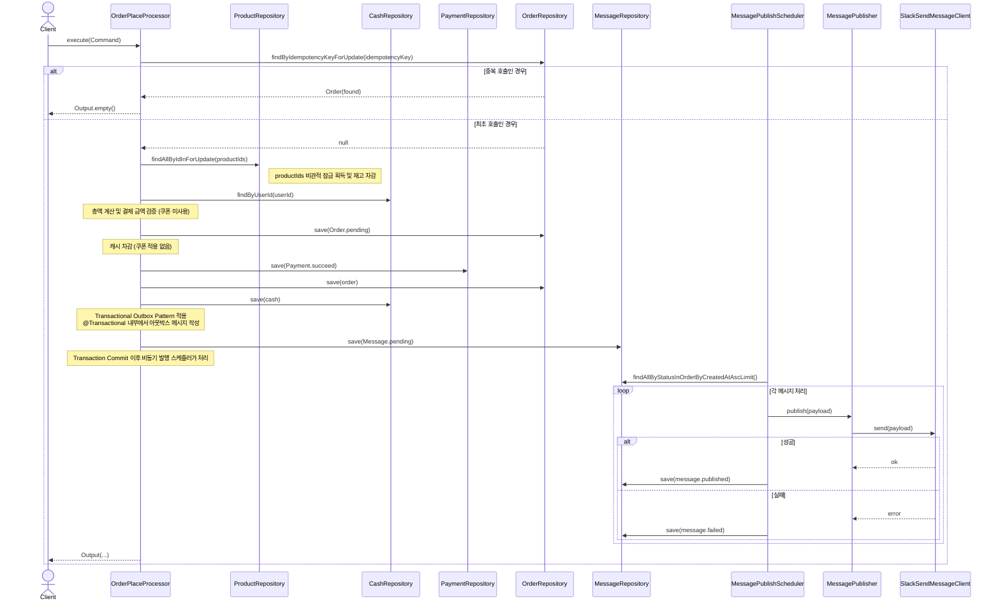

# 시퀀스 다이어그램

복잡한 비즈니스 로직에 대한 시퀀스 다이어그램을 작성했습니다.

1. 사용자 쿠폰 발급
2. 주문 및 결제

## 1. 사용자 쿠폰 발급

```mermaid
sequenceDiagram
    actor Client
    participant Processor as UserCouponIssueProcessor
    participant CouponRepo as CouponJpaRepository
    participant UserCouponRepo as UserCouponRepository
    Client ->> Processor: execute(Command)
    activate Processor
    Processor ->> CouponRepo: findByIdForUpdate(couponId)
    Note right of CouponRepo: 쿠폰 비관적 잠금 획득
    CouponRepo -->> Processor: CouponEntity
    Note over Processor: coupon.issue(LocalDateTime now)<br/>1. 발급 기간 검증<br/>2. 재고(발급 가능 수량) 확인<br/>3. 재고 감소<br/>※ 실패 시 예외 발생
    Processor ->> UserCouponRepo: existsByUserIdAndCouponId()
    Note right of UserCouponRepo: 사용자 쿠폰 중복 발급 여부 확인

    alt 이미 발급된 경우
        UserCouponRepo -->> Processor: true
        Processor -->> Client: ALREADY_ISSUED_COUPON
    else 정상
        UserCouponRepo -->> Processor: false
    end

    Note over Processor: UserCouponEntity.of()<br/>사용자 쿠폰 엔티티 생성
    Note over Processor: 쿠폰 및 사용자 쿠폰 저장
    Processor -->> Client: Output(coupon, userCoupon)
```

## 2. 주문 및 결제

### 2-1 쿠폰을 사용한 주문 및 결제

```mermaid
sequenceDiagram
    actor Client
    participant Processor as OrderPlaceProcessor
    participant ProductRepo as ProductRepository
    participant CashRepo as CashRepository
    participant UserCouponRepo as UserCouponRepository
    participant PaymentRepo as PaymentRepository
    participant OrderRepo as OrderRepository
    participant MessageRepo as MessageRepository
    participant Scheduler as MessagePublishScheduler
    participant ExtPublisher as MessagePublisher
    participant Slack as SlackSendMessageClient
    Client ->> Processor: execute(Command)
    Processor ->> OrderRepo: findByIdempotencyKeyForUpdate(idempotencyKey)
    alt 중복 호출인 경우
        OrderRepo -->> Processor: Order(found)
        Processor -->> Client: Output.empty()
    else 최초 호출인 경우
        OrderRepo -->> Processor: null
        Processor ->> ProductRepo: findAllByIdInForUpdate(productIds)
        Note right of ProductRepo: productIds의 비관적 잠금 획득 및 재고 차감
        Processor ->> CashRepo: findByUserId(userId)
        Note over Processor: 사용할 쿠폰이 존재한다고 가정
        Processor ->> UserCouponRepo: findById(userCouponId)
        Note right of UserCouponRepo: 사용자 쿠폰 조회 및 유효성 검증(만료/이미 사용 여부)
        Processor ->> OrderRepo: save(Order.pending)
        Note over Processor: 총액 계산 및 결제 금액 검증 (쿠폰 할인 적용)
        Note over Processor: 캐시 차감 및 쿠폰 사용 처리
        Processor ->> PaymentRepo: save(Payment.succeed)
        Processor ->> UserCouponRepo: save(userCoupon.used)
        Processor ->> OrderRepo: save(order)
        Processor ->> CashRepo: save(cash)
        Note over Processor: Transactional Outbox Pattern 적용<br/>@Transactional 내부에서 아웃박스 메시지 작성
        Processor ->> MessageRepo: save(Message.pending)
        Note over Processor: Transaction Commit 이후 비동기 발행 스케줄러가 처리
        Scheduler ->> MessageRepo: findAllByStatusInOrderByCreatedAtAscLimit()
        loop 각 메시지 처리
            Scheduler ->> ExtPublisher: publish(payload)
            ExtPublisher ->> Slack: send(payload)
            alt 성공
                Slack -->> ExtPublisher: ok
                Scheduler ->> MessageRepo: save(message.published)
            else 실패
                Slack -->> ExtPublisher: error
                Scheduler ->> MessageRepo: save(message.failed)
            end
        end
        Processor -->> Client: Output(...)
    end
```

### 2-2 쿠폰을 사용하지 않은 주문 및 결제

```mermaid
sequenceDiagram
    actor Client
    participant Processor as OrderPlaceProcessor
    participant ProductRepo as ProductRepository
    participant CashRepo as CashRepository
    participant PaymentRepo as PaymentRepository
    participant OrderRepo as OrderRepository
    participant MessageRepo as MessageRepository
    participant Scheduler as MessagePublishScheduler
    participant ExtPublisher as MessagePublisher
    participant Slack as SlackSendMessageClient
    Client ->> Processor: execute(Command)
    Processor ->> OrderRepo: findByIdempotencyKeyForUpdate(idempotencyKey)
    alt 중복 호출인 경우
        OrderRepo -->> Processor: Order(found)
        Processor -->> Client: Output.empty()
    else 최초 호출인 경우
        OrderRepo -->> Processor: null
        Processor ->> ProductRepo: findAllByIdInForUpdate(productIds)
        Note right of ProductRepo: productIds 비관적 잠금 획득 및 재고 차감
        Processor ->> CashRepo: findByUserId(userId)
        Note over Processor: 총액 계산 및 결제 금액 검증 (쿠폰 미사용)
        Processor ->> OrderRepo: save(Order.pending)
        Note over Processor: 캐시 차감 (쿠폰 적용 없음)
        Processor ->> PaymentRepo: save(Payment.succeed)
        Processor ->> OrderRepo: save(order)
        Processor ->> CashRepo: save(cash)
        Note over Processor: Transactional Outbox Pattern 적용<br/>@Transactional 내부에서 아웃박스 메시지 작성
        Processor ->> MessageRepo: save(Message.pending)
        Note over Processor: Transaction Commit 이후 비동기 발행 스케줄러가 처리
        Scheduler ->> MessageRepo: findAllByStatusInOrderByCreatedAtAscLimit()
        loop 각 메시지 처리
            Scheduler ->> ExtPublisher: publish(payload)
            ExtPublisher ->> Slack: send(payload)
            alt 성공
                Slack -->> ExtPublisher: ok
                Scheduler ->> MessageRepo: save(message.published)
            else 실패
                Slack -->> ExtPublisher: error
                Scheduler ->> MessageRepo: save(message.failed)
            end
        end
        Processor -->> Client: Output(...)
    end
```

