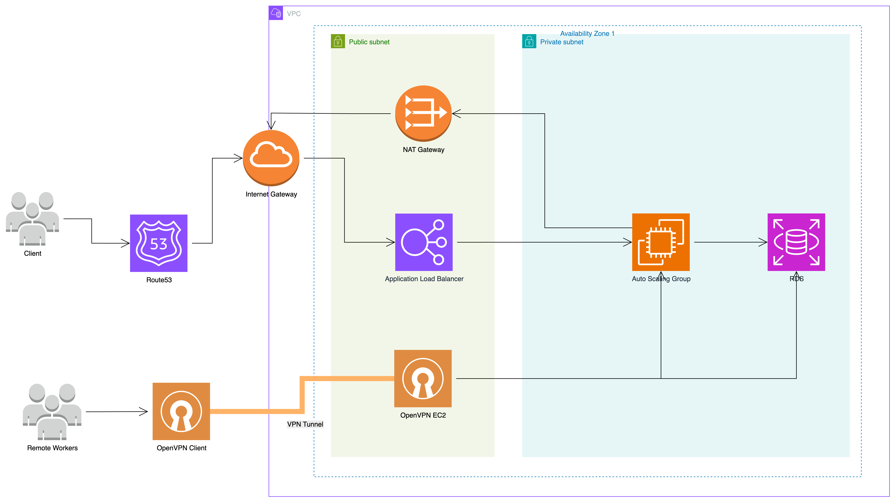

# System Architecture

### Route 53
AWS에서 제공하는 DNS(도메인 네임 시스템) 서비스입니다.
도메인 이름을 IP 주소로 변환해주는 역할을 합니다.

### Application Load Balancer

AWS에서 제공하는 애플리케이션 로드 밸런서입니다.
Client와 Auto Scaling Group 사이에 위치해 있으며, 
Client의 요청을 Auto Scaling Group에 속한 EC2 인스턴스들로 고르게 분배해주는 역할을 합니다.

### Auto Scaling Group
AWS에서 제공하는 관리형 오토스케일링 서비스입니다.
Auto Scaling Group에 속한 EC2 인스턴스들은 Application Load Balancer를 통해서만 외부와 통신할 수 있습니다.

Auto Scaling Group은 트래픽 변화에 따라 EC2 인스턴스의 개수를 자동으로 늘리거나 줄여주는 역할을 합니다.

### RDS(Relational Database Service)
AWS에서 제공하는 관리형 관계형 데이터베이스 서비스입니다.

### NAT(Network Address Translation) Gateway
Private Subnet에 있는 리소스들이 인터넷과 통신할 수 있도록 Public IP로 변환해주는 역할을 합니다.

### Internet Gateway
VPC가 인터넷과 통신할 수 있게 해주는 문(door) 역할을 합니다.

### OpenVPN Client / OpenVPN EC2
Private Subnet에 존재하는 리소스들에 접근할 수 있도록 해주는 VPN 서버입니다.
외부에서는 OpenVPN Client를 통해서만 접근할 수 있습니다.
