# [Trouble Shooting] 동일 사용자가 다른 상품 동시 주문시 데드락 발생

## 문제 상황

- 동일한 사용자가 다른 상품 A, B를 주문 시에 데드락이 발생했습니다.
- 에러: Deadlock found when trying to get lock (MySQL Error: 1213)

### Test code

```java
class OrderPlaceProcessorConcurrencyIntegrationTest extends AbstractIntegrationTestSupport {
	/**
	 * 작성 이유: 동일 사용자의 여러 주문 요청이 동시에 발생할 때,
	 * 잔액 검증의 Race condition으로 인한 음수 잔액 발생 여부를 검증합니다.
	 */
	@IntegrationTest
	void 동일_사용자가_여러_상품을_동시에_주문할_때_잔액이_부족하면_예외를_발생시킨다() throws InterruptedException {
		// given
		final int threadCount = 2;
		final BigDecimal balance = BigDecimal.valueOf(9_900);
		UserEntity user = userJpaRepository.save(UserEntity.builder()
			.email("userA@gmail.com")
			.encryptedPassword("encrypted_password")
			.status(UserStatus.ACTIVE)
			.build());

		final Long userId = user.getId();
		cashJpaRepository.save(
			CashEntity.fromDomain(Cash.restore(
				null,
				userId,
				balance
			)));

		Product productA = productJpaRepository.save(ProductEntity.builder()
			.name("오뚜기 진라면 매운맛 120g")
			.price(BigDecimal.valueOf(5_000))
			.stock(1)
			.build()).toDomain();

		Product productB = productJpaRepository.save(ProductEntity.builder()
			.name("스타벅스 아메리카노")
			.price(BigDecimal.valueOf(5_000))
			.stock(1)
			.build()).toDomain();

		List<Product> products = List.of(productA, productB);

		CountDownLatch countDownLatch = new CountDownLatch(threadCount);
		ExecutorService executorService = Executors.newFixedThreadPool(threadCount);

		// when
		IntStream.range(0, threadCount)
			.forEach((index) -> executorService.execute(() -> {
				try {
					transactionTemplate.executeWithoutResult(
						status -> orderPlaceProcessor.execute(generateCommand(userId, products.get(index))));
				} catch (Exception e) {
				} finally {
					countDownLatch.countDown();
				}
			}));

		countDownLatch.await();

		// then
		CashEntity cash = cashJpaRepository.findByUserId(userId)
			.orElseThrow();

		System.out.println("cash.getBalance() = " + cash.getBalance());
		assertThat(cash.getBalance().compareTo(BigDecimal.valueOf(4_900))).isZero()
			.as("처음 주문한 상품만 결제가 가능해야 한다.");
	}

}

```

### Console

```shell
2025-10-29T12:34:17.181+09:00  WARN 55092 --- [hhplus] [pool-2-thread-1] o.h.engine.jdbc.spi.SqlExceptionHelper   : SQL Error: 1213, SQLState: 40001
2025-10-29T12:34:17.181+09:00 ERROR 55092 --- [hhplus] [pool-2-thread-1] o.h.engine.jdbc.spi.SqlExceptionHelper   : Deadlock found when trying to get lock; try restarting transaction
e.getMessage() = could not execute statement [Deadlock found when trying to get lock; try restarting transaction] [insert into orders (amount,confirmed_at,created_at,discount_amount,final_amount,idempotency_key,modified_at,status,user_id) values (?,?,?,?,?,?,?,?,?)]; SQL [insert into orders (amount,confirmed_at,created_at,discount_amount,final_amount,idempotency_key,modified_at,status,user_id) values (?,?,?,?,?,?,?,?,?)]
org.springframework.dao.CannotAcquireLockException: could not execute statement [Deadlock found when trying to get lock; try restarting transaction] [insert into orders (amount,confirmed_at,created_at,discount_amount,final_amount,idempotency_key,modified_at,status,user_id) values (?,?,?,?,?,?,?,?,?)]; SQL [insert into orders (amount,confirmed_at,created_at,discount_amount,final_amount,idempotency_key,modified_at,status,user_id) values (?,?,?,?,?,?,?,?,?)]
	at org.springframework.orm.jpa.vendor.HibernateJpaDialect.convertHibernateAccessException(HibernateJpaDialect.java:283)
	at org.springframework.orm.jpa.vendor.HibernateJpaDialect.translateExceptionIfPossible(HibernateJpaDialect.java:244)
	at org.springframework.orm.jpa.AbstractEntityManagerFactoryBean.translateExceptionIfPossible(AbstractEntityManagerFactoryBean.java:560)
	at org.springframework.dao.support.ChainedPersistenceExceptionTranslator.translateExceptionIfPossible(ChainedPersistenceExceptionTranslator.java:61)
	at org.springframework.dao.support.DataAccessUtils.translateIfNecessary(DataAccessUtils.java:343)
	at org.springframework.dao.support.PersistenceExceptionTranslationInterceptor.invoke(PersistenceExceptionTranslationInterceptor.java:160)
	at org.springframework.aop.framework.ReflectiveMethodInvocation.proceed(ReflectiveMethodInvocation.java:184)
	at org.springframework.data.jpa.repository.support.CrudMethodMetadataPostProcessor$CrudMethodMetadataPopulatingMethodInterceptor.invoke(CrudMethodMetadataPostProcessor.java:165)
	at org.springframework.aop.framework.ReflectiveMethodInvocation.proceed(ReflectiveMethodInvocation.java:184)
	at org.springframework.aop.framework.JdkDynamicAopProxy.invoke(JdkDynamicAopProxy.java:223)
	at jdk.proxy1/jdk.proxy1.$Proxy204.save(Unknown Source)
	at kr.hhplus.be.commerce.infrastructure.persistence.order.OrderRepositoryImpl.save(OrderRepositoryImpl.java:19)
	at kr.hhplus.be.commerce.application.order.OrderPlaceProcessor.execute(OrderPlaceProcessor.java:78)
	at kr.hhplus.be.commerce.application.order.OrderPlaceProcessorConcurrencyIntegrationTest.lambda$동일_사용자가_여러_상품을_동시에_주문할_때_잔액이_부족하면_예외를_발생시킨다$0(OrderPlaceProcessorConcurrencyIntegrationTest.java:123)
	at org.springframework.transaction.support.TransactionOperations.lambda$executeWithoutResult$0(TransactionOperations.java:68)
	at org.springframework.transaction.support.TransactionTemplate.execute(TransactionTemplate.java:140)
	at org.springframework.transaction.support.TransactionOperations.executeWithoutResult(TransactionOperations.java:67)
	at kr.hhplus.be.commerce.application.order.OrderPlaceProcessorConcurrencyIntegrationTest.lambda$동일_사용자가_여러_상품을_동시에_주문할_때_잔액이_부족하면_예외를_발생시킨다$1(OrderPlaceProcessorConcurrencyIntegrationTest.java:122)
	at java.base/java.util.concurrent.ThreadPoolExecutor.runWorker(ThreadPoolExecutor.java:1136)
	at java.base/java.util.concurrent.ThreadPoolExecutor$Worker.run(ThreadPoolExecutor.java:635)
	at java.base/java.lang.Thread.run(Thread.java:833)
Caused by: org.hibernate.exception.LockAcquisitionException: could not execute statement [Deadlock found when trying to get lock; try restarting transaction] [insert into orders (amount,confirmed_at,created_at,discount_amount,final_amount,idempotency_key,modified_at,status,user_id) values (?,?,?,?,?,?,?,?,?)]
	at org.hibernate.dialect.MySQLDialect.lambda$buildSQLExceptionConversionDelegate$3(MySQLDialect.java:1260)
	at org.hibernate.exception.internal.StandardSQLExceptionConverter.convert(StandardSQLExceptionConverter.java:58)
	at org.hibernate.engine.jdbc.spi.SqlExceptionHelper.convert(SqlExceptionHelper.java:108)
	at org.hibernate.engine.jdbc.internal.ResultSetReturnImpl.executeUpdate(ResultSetReturnImpl.java:197)
	at org.hibernate.id.insert.GetGeneratedKeysDelegate.performMutation(GetGeneratedKeysDelegate.java:116)
	at org.hibernate.engine.jdbc.mutation.internal.MutationExecutorSingleNonBatched.performNonBatchedOperations(MutationExecutorSingleNonBatched.java:47)
	at org.hibernate.engine.jdbc.mutation.internal.AbstractMutationExecutor.execute(AbstractMutationExecutor.java:55)
	at org.hibernate.persister.entity.mutation.InsertCoordinatorStandard.doStaticInserts(InsertCoordinatorStandard.java:194)
	at org.hibernate.persister.entity.mutation.InsertCoordinatorStandard.coordinateInsert(InsertCoordinatorStandard.java:132)
	at org.hibernate.persister.entity.mutation.InsertCoordinatorStandard.insert(InsertCoordinatorStandard.java:95)
	at org.hibernate.action.internal.EntityIdentityInsertAction.execute(EntityIdentityInsertAction.java:85)
	at org.hibernate.engine.spi.ActionQueue.execute(ActionQueue.java:682)
	at org.hibernate.engine.spi.ActionQueue.addResolvedEntityInsertAction(ActionQueue.java:293)
	at org.hibernate.engine.spi.ActionQueue.addInsertAction(ActionQueue.java:274)
	at org.hibernate.engine.spi.ActionQueue.addAction(ActionQueue.java:324)
	at org.hibernate.event.internal.AbstractSaveEventListener.addInsertAction(AbstractSaveEventListener.java:393)
	at org.hibernate.event.internal.AbstractSaveEventListener.performSaveOrReplicate(AbstractSaveEventListener.java:307)
	at org.hibernate.event.internal.AbstractSaveEventListener.performSave(AbstractSaveEventListener.java:223)
	at org.hibernate.event.internal.AbstractSaveEventListener.saveWithGeneratedId(AbstractSaveEventListener.java:136)
	at org.hibernate.event.internal.DefaultPersistEventListener.entityIsTransient(DefaultPersistEventListener.java:177)
	at org.hibernate.event.internal.DefaultPersistEventListener.persist(DefaultPersistEventListener.java:95)
	at org.hibernate.event.internal.DefaultPersistEventListener.onPersist(DefaultPersistEventListener.java:79)
	at org.hibernate.event.internal.DefaultPersistEventListener.onPersist(DefaultPersistEventListener.java:55)
	at org.hibernate.event.service.internal.EventListenerGroupImpl.fireEventOnEachListener(EventListenerGroupImpl.java:127)
	at org.hibernate.internal.SessionImpl.firePersist(SessionImpl.java:761)
	at org.hibernate.internal.SessionImpl.persist(SessionImpl.java:745)
	at java.base/jdk.internal.reflect.NativeMethodAccessorImpl.invoke0(Native Method)
	at java.base/jdk.internal.reflect.NativeMethodAccessorImpl.invoke(NativeMethodAccessorImpl.java:77)
	at java.base/jdk.internal.reflect.DelegatingMethodAccessorImpl.invoke(DelegatingMethodAccessorImpl.java:43)
	at java.base/java.lang.reflect.Method.invoke(Method.java:568)
	at org.springframework.orm.jpa.SharedEntityManagerCreator$SharedEntityManagerInvocationHandler.invoke(SharedEntityManagerCreator.java:320)
	at jdk.proxy1/jdk.proxy1.$Proxy188.persist(Unknown Source)
	at org.springframework.data.jpa.repository.support.SimpleJpaRepository.save(SimpleJpaRepository.java:627)
	at java.base/jdk.internal.reflect.NativeMethodAccessorImpl.invoke0(Native Method)
	at java.base/jdk.internal.reflect.NativeMethodAccessorImpl.invoke(NativeMethodAccessorImpl.java:77)
	at java.base/jdk.internal.reflect.DelegatingMethodAccessorImpl.invoke(DelegatingMethodAccessorImpl.java:43)
	at java.base/java.lang.reflect.Method.invoke(Method.java:568)
	at org.springframework.aop.support.AopUtils.invokeJoinpointUsingReflection(AopUtils.java:359)
	at org.springframework.data.repository.core.support.RepositoryMethodInvoker$RepositoryFragmentMethodInvoker.lambda$new$0(RepositoryMethodInvoker.java:277)
	at org.springframework.data.repository.core.support.RepositoryMethodInvoker.doInvoke(RepositoryMethodInvoker.java:170)
	at org.springframework.data.repository.core.support.RepositoryMethodInvoker.invoke(RepositoryMethodInvoker.java:158)
	at org.springframework.data.repository.core.support.RepositoryComposition$RepositoryFragments.invoke(RepositoryComposition.java:515)
	at org.springframework.data.repository.core.support.RepositoryComposition.invoke(RepositoryComposition.java:284)
	at org.springframework.data.repository.core.support.RepositoryFactorySupport$ImplementationMethodExecutionInterceptor.invoke(RepositoryFactorySupport.java:752)
	at org.springframework.aop.framework.ReflectiveMethodInvocation.proceed(ReflectiveMethodInvocation.java:184)
	at org.springframework.data.repository.core.support.QueryExecutorMethodInterceptor.doInvoke(QueryExecutorMethodInterceptor.java:174)
	at org.springframework.data.repository.core.support.QueryExecutorMethodInterceptor.invoke(QueryExecutorMethodInterceptor.java:149)
	at org.springframework.aop.framework.ReflectiveMethodInvocation.proceed(ReflectiveMethodInvocation.java:184)
	at org.springframework.data.projection.DefaultMethodInvokingMethodInterceptor.invoke(DefaultMethodInvokingMethodInterceptor.java:69)
	at org.springframework.aop.framework.ReflectiveMethodInvocation.proceed(ReflectiveMethodInvocation.java:184)
	at org.springframework.transaction.interceptor.TransactionAspectSupport.invokeWithinTransaction(TransactionAspectSupport.java:380)
	at org.springframework.transaction.interceptor.TransactionInterceptor.invoke(TransactionInterceptor.java:119)
	at org.springframework.aop.framework.ReflectiveMethodInvocation.proceed(ReflectiveMethodInvocation.java:184)
	at org.springframework.dao.support.PersistenceExceptionTranslationInterceptor.invoke(PersistenceExceptionTranslationInterceptor.java:138)
	... 15 more
Caused by: com.mysql.cj.jdbc.exceptions.MySQLTransactionRollbackException: Deadlock found when trying to get lock; try restarting transaction
	at com.mysql.cj.jdbc.exceptions.SQLError.createSQLException(SQLError.java:115)
	at com.mysql.cj.jdbc.exceptions.SQLExceptionsMapping.translateException(SQLExceptionsMapping.java:114)
	at com.mysql.cj.jdbc.ClientPreparedStatement.executeInternal(ClientPreparedStatement.java:988)
	at com.mysql.cj.jdbc.ClientPreparedStatement.executeUpdateInternal(ClientPreparedStatement.java:1166)
	at com.mysql.cj.jdbc.ClientPreparedStatement.executeUpdateInternal(ClientPreparedStatement.java:1101)
	at com.mysql.cj.jdbc.ClientPreparedStatement.executeLargeUpdate(ClientPreparedStatement.java:1467)
	at com.mysql.cj.jdbc.ClientPreparedStatement.executeUpdate(ClientPreparedStatement.java:1084)
	at com.zaxxer.hikari.pool.ProxyPreparedStatement.executeUpdate(ProxyPreparedStatement.java:61)
```

## 원인 분석

`orders` 테이블에는 unique index 제약 조건이 `idempotency_key`에 걸려있습니다.
중복 주문 방지를 위한 사전 선점 검사로 `SELECT ... WHERE idempotency_key = :idempotency_key FOR UPDATE`를 수행할 때, 레코드가 존재하지 않으면 InnoDB가 해당
유니크 키가 삽입될 위치에 갭 락을 점유합니다. (아무런 레코드가 없는 `orders` 테이블의 경우 unique index 전체에 잠금이 걸립니다.)

동시에 여러 트랜잭션(T1, T2)이 서로 다른 idempotency_key로 갭 락을 선점한 뒤, 후속 단계에서 orders INSERT에 대한 잠금을 상호 교차 순서로 취득하려 하면서 데드락(1213)이
발생했고, MySQL이 데드락을 감지하고 하나의 트랜잭션을 롤백 시키고 오류 메세지를 반환했습니다.

### Sequence diagram

```mermaid
sequenceDiagram
    participant T1 as Transaction 1<br/>(Product A 주문)
    participant DB as MySQL InnoDB
    participant T2 as Transaction 2<br/>(Product B 주문)
    Note over T1, T2: 동일 사용자, 다른 상품 동시 주문 시작

    rect rgb(240, 248, 255)
        Note over T1, T2: 1단계: 중복 주문 검사 (SELECT FOR UPDATE)
        T1 ->> DB: SELECT * FROM orders<br/>WHERE idempotency_key='order-A'<br/>FOR UPDATE
        Note right of DB: 레코드 없음<br/>→ Gap Lock 획득<br/>(unique index 전체)
        DB -->> T1: Empty Result + Gap Lock
        T2 ->> DB: SELECT * FROM orders<br/>WHERE idempotency_key='order-B'<br/>FOR UPDATE
        Note right of DB: 레코드 없음<br/>→ Gap Lock 획득<br/>(unique index 전체)
        DB -->> T2: Empty Result + Gap Lock
    end

    rect rgb(255, 250, 240)
        Note over T1, T2: 2단계: 주문 생성 (INSERT)
        T1 ->> DB: INSERT INTO orders<br/>(idempotency_key='order-A', ...)
        Note right of DB: T2의 Gap Lock 대기 ⏳
        T2 ->> DB: INSERT INTO orders<br/>(idempotency_key='order-B', ...)
        Note right of DB: T1의 Gap Lock 대기 ⏳
    end

    rect rgb(255, 240, 240)
        Note over T1, T2: 💥 데드락 발생!
        DB ->> DB: Deadlock Detection
        DB -->> T2: ❌ Deadlock Exception<br/>(Transaction Rollback)
        DB -->> T1: ✅ INSERT Success
    end

    Note over T1, T2: MySQL이 T2를 롤백하고 T1만 성공
```



### Business code

```java

@Slf4j
@RequiredArgsConstructor
public class OrderPlaceProcessor {
	private final OrderRepository orderRepository;
	private final PaymentRepository paymentRepository;
	private final ProductRepository productRepository;
	private final UserCouponRepository userCouponRepository;
	private final CashRepository cashRepository;
	private final CashHistoryRepository cashHistoryRepository;
	private final MessageRepository messageRepository;

	@Transactional
	public Output execute(Command command) {
		command.validate();

		/**
		 * 중복 호출인 경우 반환합니다.
		 */
		Optional<Order> alreadyPlacedOrderOpt = orderRepository.findByIdempotencyKeyForUpdate(command.idempotencyKey);
		if (alreadyPlacedOrderOpt.isPresent()) {
			return Output.empty();
		}

		// 상품의 비관적 잠금을 획득한 상태로 조회 및 재고를 감소시킵니다.
		List<Product> productsWithDecreasedStock = decreaseStock(command, fetchProductsForUpdate(command));

		Cash cash = cashRepository.findByUserId(command.userId)
			.orElseThrow(() -> new CommerceException(CommerceCode.NOT_FOUND_CASH));

		// 주문 및 잔액을 차감합니다.
		// 주문 식별자를 미리 받기 위해서 save method를 호출합니다.
		Order order = orderRepository.save(Order.ofPending(command.userId))
			.place(toOrderPlaceInput(command, productsWithDecreasedStock, command.idempotencyKey));

		messageRepository.save(Message.ofPending(
			order.id(),
			MessageTargetType.ORDER,
			OrderConfirmedMessagePayload.from(order.id())
		));

		return isNull(command.userCouponId) ?
			executeWithoutCoupon(command, order, cash, productsWithDecreasedStock) :
			executeWithCoupon(command, order, cash, productsWithDecreasedStock);
	}

	private List<Product> fetchProductsForUpdate(Command command) {
		List<Long> productIds = command.toProductIds();
		List<Product> products = productRepository.findAllByIdInForUpdate(productIds);
		if (products.size() != productIds.size()) {
			throw new CommerceException(CommerceCode.NOT_FOUND_PRODUCT);
		}
		return products;
	}

	private List<Product> decreaseStock(Command command, List<Product> products) {
		Map<Long, Product> productIdToProductMap = products
			.stream()
			.collect(toMap(Product::id, product -> product));

		// 재고를 차감합니다.
		return command.orderLineCommands()
			.stream()
			.map(orderLineCommand -> {
				Product product = productIdToProductMap.get(orderLineCommand.productId());
				return product.decreaseStock(orderLineCommand.orderQuantity());
			})
			.toList();
	}

	private Output executeWithoutCoupon(Command command, Order order, Cash cash, List<Product> products) {
		validatePaymentAmountIsMatched(command.paymentAmount, order);

		BigDecimal originalBalance = cash.balance();
		Cash usedCash = cash.use(command.paymentAmount);

		Payment payment = Payment.fromOrder(command.userId, order.id(), command.paymentAmount)
			.succeed(command.now);

		cashHistoryRepository.save(
			CashHistory.recordOfPurchase(command.userId, usedCash.balance(), originalBalance));

		return new Output(
			cashRepository.save(usedCash),
			null,
			productRepository.saveAll(products),
			paymentRepository.save(payment),
			orderRepository.save(order)
		);
	}

	private Output executeWithCoupon(Command command, Order order, Cash cash, List<Product> products) {
		UserCoupon userCoupon = userCouponRepository.findById(command.userCouponId)
			.orElseThrow(() -> new CommerceException(CommerceCode.NOT_FOUND_USER_COUPON));

		validatePaymentAmountIsMatched(command.paymentAmount, userCoupon, order);
		userCoupon.use(command.userId, command.now, order.id());

		BigDecimal originalBalance = cash.balance();
		Cash usedCash = cash.use(command.paymentAmount);

		Payment payment = Payment.fromOrder(command.userId, order.id(),
				command.paymentAmount)
			.succeed(command.now);

		cashHistoryRepository.save(
			CashHistory.recordOfPurchase(command.userId, usedCash.balance(), originalBalance));

		return new Output(
			cashRepository.save(cash),
			userCouponRepository.save(userCoupon),
			productRepository.saveAll(products),
			paymentRepository.save(payment),
			orderRepository.save(order)
		);
	}

	private void validatePaymentAmountIsMatched(BigDecimal paymentAmount, UserCoupon userCoupon,
		Order order) {
		BigDecimal actualPaymentAmount = userCoupon.calculateFinalAmount(order.amount());
		if (paymentAmount.compareTo(actualPaymentAmount) != 0) {
			throw new CommerceException(CommerceCode.MISMATCHED_EXPECTED_AMOUNT);
		}
	}

	private void validatePaymentAmountIsMatched(BigDecimal paymentAmount, Order order) {
		BigDecimal actualPaymentAmount = order.amount();
		if (paymentAmount.compareTo(actualPaymentAmount) != 0) {
			throw new CommerceException(CommerceCode.MISMATCHED_EXPECTED_AMOUNT);
		}
	}

	private OrderPlaceInput toOrderPlaceInput(Command command, List<Product> products, String idempotencyKey) {
		Map<Long, Product> productIdToProductMap = products
			.stream()
			.collect(toMap(Product::id, product -> product));

		return OrderPlaceInput.builder()
			.idempotencyKey(idempotencyKey)
			.userId(command.userId())
			.orderLineInputs(command.orderLineCommands()
				.stream()
				.map(orderLineCommand -> {
					Product product = productIdToProductMap.get(orderLineCommand.productId());
					return OrderPlaceInput.OrderLineInput
						.builder()
						.productId(product.id())
						.productName(product.name())
						.productPrice(product.price())
						.orderQuantity(orderLineCommand.orderQuantity())
						.build();
				})
				.toList())
			.build();
	}

	public record Command(
		String idempotencyKey,
		Long userId,
		Long userCouponId,
		BigDecimal paymentAmount,
		LocalDateTime now,
		List<OrderLineCommand> orderLineCommands
	) {
		public void validate() {
			requireNonNull(List.of(Param.of(userId), Param.of(orderLineCommands)));
			if (orderLineCommands.isEmpty()) {
				throw new CommerceException(CommerceCode.ORDER_LINE_COMMANDS_IS_EMPTY);
			}
			orderLineCommands
				.forEach(it -> {
					if (isNull(it.orderQuantity()) || it.orderQuantity() <= 0) {
						throw new CommerceException(CommerceCode.ORDER_QUANTITY_MUST_BE_POSITIVE);
					}
				});
		}

		public List<Long> toProductIds() {
			return orderLineCommands.stream()
				.map(OrderLineCommand::productId)
				.toList();
		}
	}

	public record OrderLineCommand(
		Long productId,
		Integer orderQuantity
	) {
	}

	public record Output(
		Cash cash,
		UserCoupon userCoupon,
		List<Product> products,
		Payment payment,
		Order order
	) {
		public static Output empty() {
			return new Output(
				null,
				null,
				List.of(),
				null,
				null
			);
		}
	}
}

```

## 해결 방법

1. orders (idempotency_key) unique index -> user (id) clustering index로 잠금 변경 (✅)
2. DataIntegrityViolationException이 발생했을 경우 Rollback 처리
3. MySQL Named lock을 이용한 동시성 제어
4. Optimistic lock을 이용한 동시성 제어

## 선택한 해결책 및 이유

해결 방법 1번을 선택했습니다. (orders (idempotency_key) unique index -> user (id) clustering index로 잠금 변경)

- 구현 난이도가 가장 간단합니다.
- 데드락의 발생 가능성을 없앱니다.

### Business code

```java

@Slf4j
@RequiredArgsConstructor
public class OrderPlaceProcessor {
	private final OrderRepository orderRepository;
	private final PaymentRepository paymentRepository;
	private final ProductRepository productRepository;
	private final UserCouponRepository userCouponRepository;
	private final CashRepository cashRepository;
	private final CashHistoryRepository cashHistoryRepository;
	private final MessageRepository messageRepository;
	private final UserRepository userRepository;

	@Transactional
	public Output execute(Command command) {
		command.validate();

		// user의 id값으로 잠금을 획득합니다.
		userRepository.findByIdForUpdate(command.userId)
			.orElseThrow(() -> new CommerceException(CommerceCode.NOT_FOUND_USER));

		Optional<Order> alreadyPlacedOrderOpt = orderRepository.findByIdempotencyKey(command.idempotencyKey);
		if (alreadyPlacedOrderOpt.isPresent()) {
			return Output.empty();
		}
		// ...
	}
}
```


